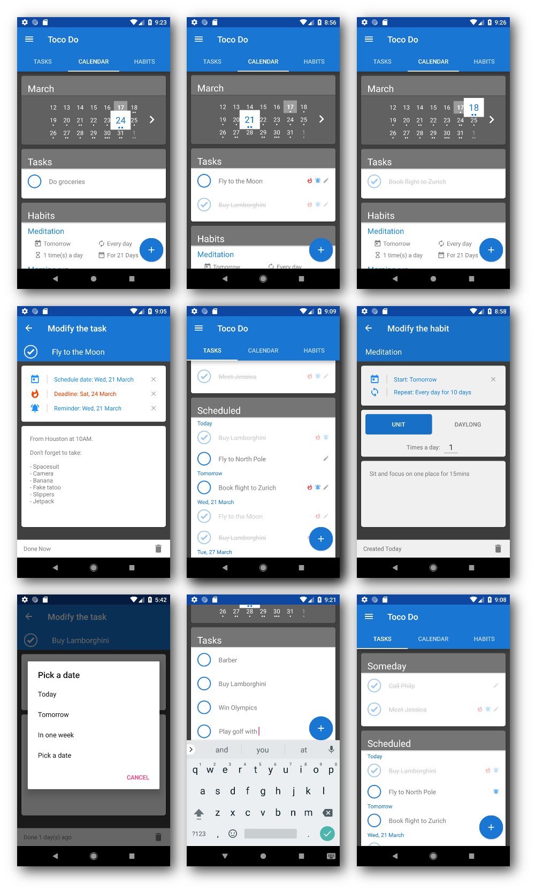

# TocoDo

**TocoDo** is the perfect tool for organising and scheduling your daily tasks.

## Gallery

## Platforms

- **Android**
- **iOS** 
- **Windows**

## Technologies

App itself is made in **Xamarin Forms** with a few custom renderers adjusting UI on each platform. The code between platforms is shared in a **.NET Standard 2.0** library. 

**Sqlite** is used for managing internal storage.
https://www.nuget.org/packages/sqlite-net-pcl/1.4.118

**TintedImage** - for displaying images with tinted color.
https://www.nuget.org/packages/Plugin.CrossPlatformTintedImage/

**Microcharts** is used for diplaying graphs.
https://www.nuget.org/packages/Microcharts.Forms/

## To-do

1) Finish habits
2) Create daily task review
3) Create a server side to share data across apps
